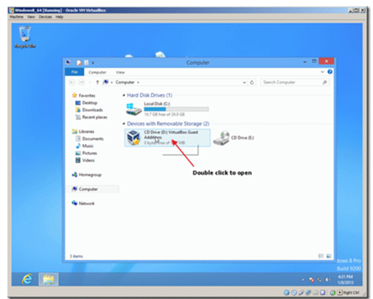
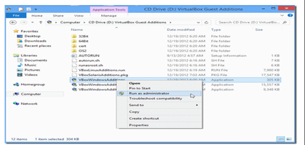
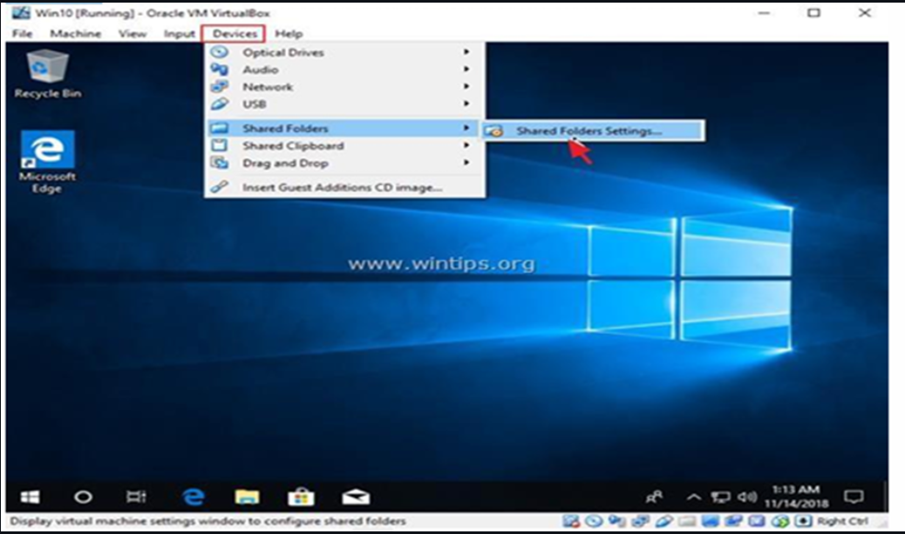
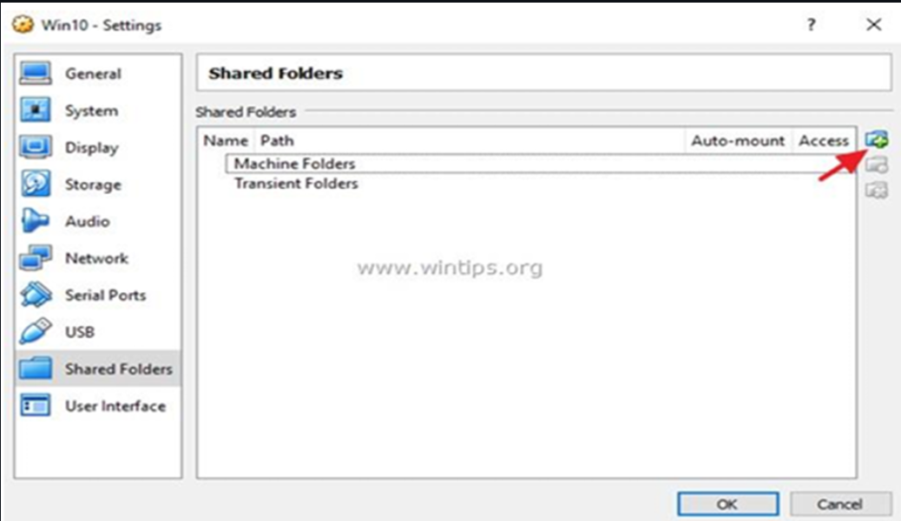
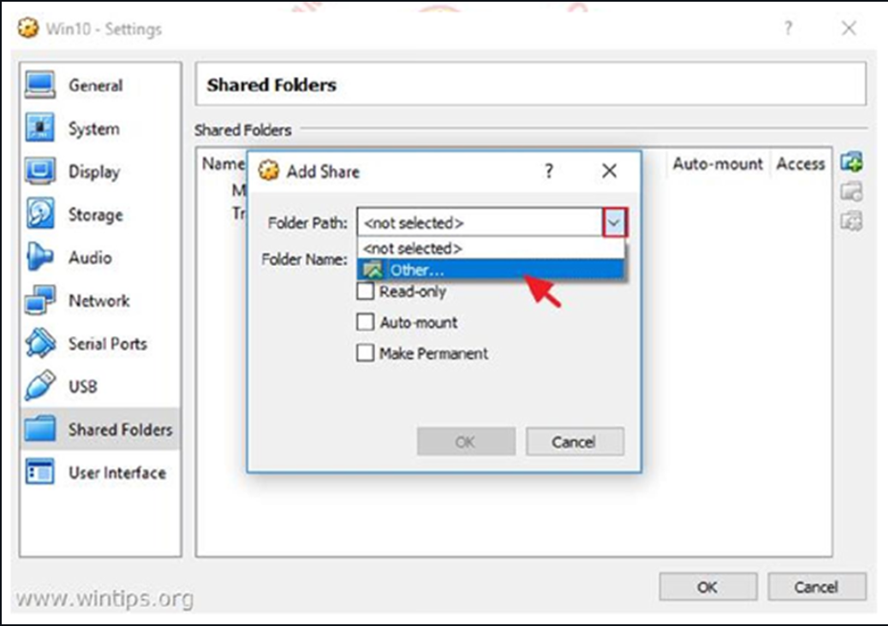
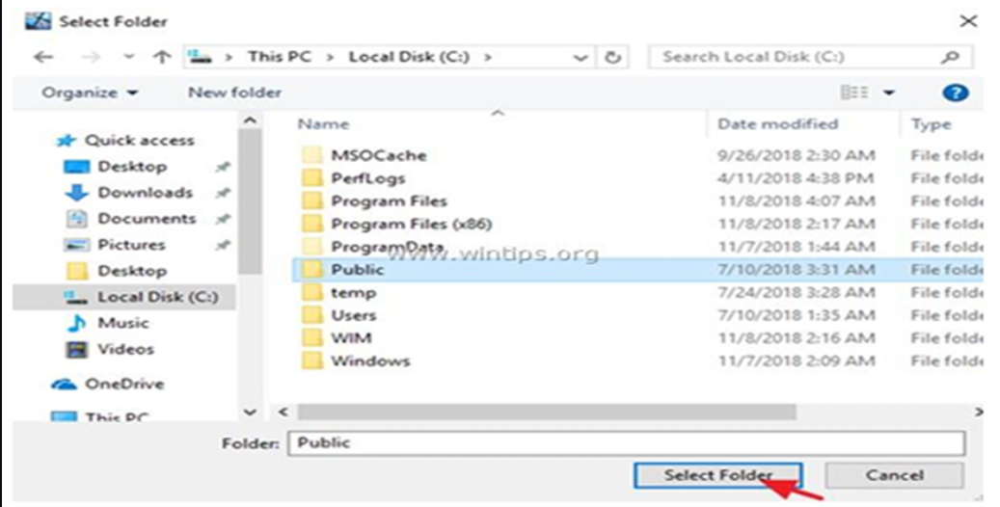
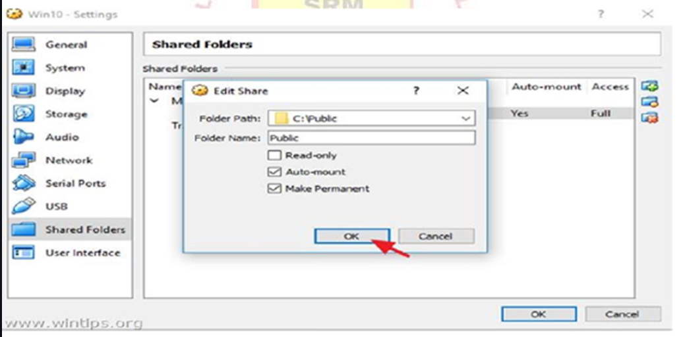

# EX 6: MOVING FILES BETWEEN VIRTUAL MACHINES

## Aim:
To move the files between virtual machine.
 You can move files between virtual machines in several ways:
•	You can copy files using network utilities as you would between physical computers on your network. To do this between two virtual machine:
•	Both virtual machines must be configured to allow access to your network.
•	Any of the networking methods (host-only, bridged and NAT) are appropriate. 
•	With host-only networking, you copy files from the virtual machines to the host and vice-versa, since host-only networking only allows the virtual machines see your host computer.
•	With bridged networking or NAT enabled, you can copy files across your network between the virtual machines.
•	You can create a shared drive, either a virtual disk or a raw partition, and mount the drive in each of the virtual machines.

## Procedure:

How to Enable File sharing in VirtualBox. 

Step 1. Install Guest Additions on the Guest machine. 
Step 2. Configure File Sharing on VirtualBox. 
 
Step 1. Install Guest Additions on the Guest machine. 
1. Start the Virtuabox Guest Machine (OS). 
2. From Oracle's VM VirtualBox main menu, select Devices > Install Guest Additions *

a. Open Windows Explorer

b. Double click at the "CD Drive (X:) VirtualBox Guest additions" to explore its contents.
		  

C.Right click at "VBoxWindowsAdditions" application and from the pop-up menu, choose "Run as administrator".
 

3.Press Next and then follow the on screen instructions to complete the Guest Additions installation.
	 

4. When the setup is completed, choose Finish and restart the Virtuabox guest machine.
Step 2. Setup File Sharing on VirtualBox Guest Machine.
1. From VirtualBox menu click Devices and choose Shared Folders -> Shared Folder Settings.

2. Click the Add new shared folder icon.
 

3. Click the drop-down arrow and select Other.
 

3. Locate and highlight (from the Host OS) the folder that you want to share between the VirtualBox Guest machine and the Host and click Select Folder. *
* Note: To make your life easier, create a new folder for the file sharing, on the Host OS and give it with a recognizable name. (e.g. "Public")
 

4. Now, in the 'Add Share' options, type a name (if you want) at the 'Folder Name box, click the Auto Mount and the Make Permanent checkboxes and click OK twice to close the Shared Folder Settings.
 

5. You 're done! To access the shared folder from the Guest OS, open Windows Explorer and under the 'Network locations' you should see a new network drive that corresponds to the shared folder on the Host OS.

## Result:

Thus the virtual machine files are moved to another VM
